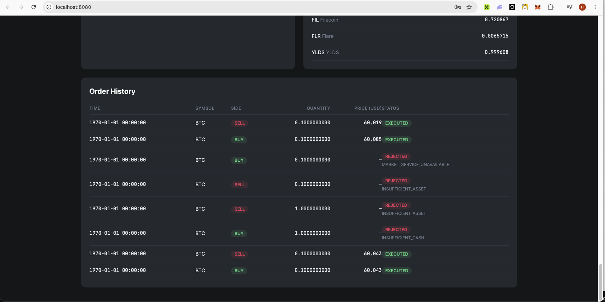
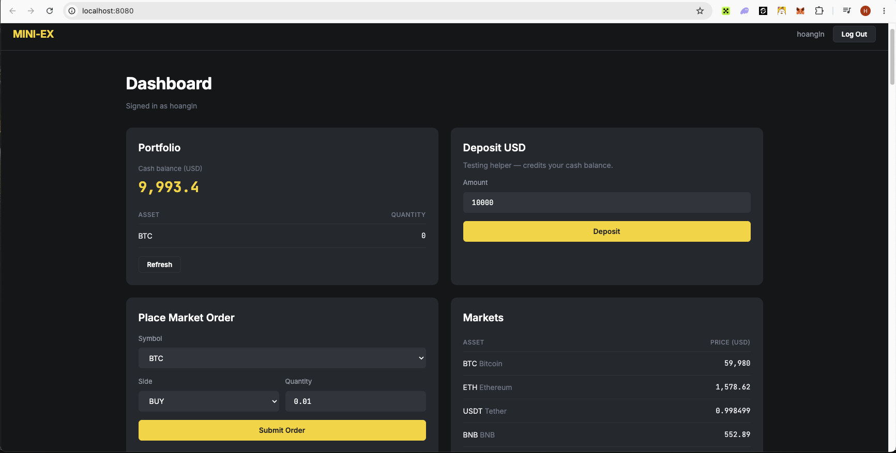

# mini-ex

A minimal crypto **exchange** backend: users sign up, deposit cash, and place
buy/sell orders that execute against live market prices. Built as a Rust
workspace with two HTTP services, two Postgres databases, and a static HTML
test front-end.

> **Note on `.env`:** the committed `.env` holds **test-only** values
> (local Postgres credentials, a dummy JWT secret, a free-tier CoinGecko key).
> It is intentionally tracked and safe to make public. Do **not** reuse these
> values in any real deployment.

## Architecture

Two independent Axum services, each owning its own Postgres database. The
portfolio service is the user-facing API; the market service owns price data
and is called over HTTP for order execution.

```
                         ┌─────────────────────────┐
  Browser / client  ───► │  frontend (nginx :8080) │
                         │  static HTML test UI    │
                         └────────────┬────────────┘
                                      │ HTTP
                                      ▼
        ┌──────────────────────────────────────────────┐
        │  portfolio-service  (:8000)                   │
        │  auth (JWT) · users · funds · orders · folio  │
        └───────┬───────────────────────────┬──────────┘
                │ HTTP (prices)              │ SeaORM
                ▼                            ▼
   ┌───────────────────────────┐   ┌──────────────────────┐
   │ market-service (:8001)    │   │ mini-ex-portfolio-db  │
   │ symbols · prices          │   │ users, asset_balances,│
   │ + CoinGecko sync (bg task)│   │ orders                │
   └──────┬──────────────┬─────┘   └──────────────────────┘
          │ SeaORM       │ HTTPS
          ▼              ▼
 ┌──────────────────┐  ┌─────────────┐
 │ mini-ex-market-db│  │  CoinGecko  │
 │ assets (prices)  │  │   API       │
 └──────────────────┘  └─────────────┘
```

### Workspace crates (`crates/`)

| Crate               | Type | Responsibility                                                                                                                                            |
| ------------------- | ---- | --------------------------------------------------------------------------------------------------------------------------------------------------------- |
| `shared`            | lib  | Cross-cutting helpers: env resolution, tracing setup, `Result`/error aliases, utils.                                                                      |
| `database`          | lib  | SeaORM entities (`users`, `assets`, `asset_balances`, `orders`), repositories, domain enums, and Prisma schemas/SQL migrations.                           |
| `market-service`    | bin  | Read-only market API (`/symbols`, `/prices`, `/prices/{symbol}`) backed by `mini-ex-market-db`. Runs a background CoinGecko sync to refresh asset prices. |
| `portfolio-service` | bin  | User-facing API: auth, funds, orders, and portfolio. Executes orders by fetching prices from `market-service`.                                            |

### Request flow (order execution)

1. Client authenticates against `portfolio-service` (`/auth/sign-up`, `/auth/sign-in`) → JWT.
2. Client deposits cash (`/funds/deposit`) and places an order (`POST /orders`).
3. `portfolio-service` fetches the current price from `market-service` and runs
   buy/sell execution: validates balance, settles cash vs. asset, and records the
   order with a status (`Created` / `Executed` / `Rejected`).
4. Orders are **idempotent** by `client_order_id`.

### Tech stack

Rust · Axum · Tokio · SeaORM · Postgres · Docker Compose.

## API surface

**portfolio-service** (`:8000`)

| Method | Path                                               | Purpose                |
| ------ | -------------------------------------------------- | ---------------------- |
| POST   | `/auth/sign-up`, `/auth/sign-in`, `/auth/sign-out` | Auth (JWT)             |
| GET    | `/users/me`                                        | Current user           |
| POST   | `/funds/deposit`                                   | Deposit cash           |
| POST   | `/orders`                                          | Place a buy/sell order |
| GET    | `/orders`, `/orders/{order_id}`                    | List / fetch orders    |
| GET    | `/portfolio/{user_id}`                             | Portfolio holdings     |

**market-service** (`:8001`)

| Method | Path                          | Purpose          |
| ------ | ----------------------------- | ---------------- |
| GET    | `/symbols`                    | Tradable symbols |
| GET    | `/prices`, `/prices/{symbol}` | Current prices   |

Each service serves its own OpenAPI docs at `/docs/openapi.yml`, `/swagger`,
and `/scalar`.

## Setup

### Prerequisites

- Docker + Docker Compose (recommended path)
- Rust, Postgres, pnpm

### Docker Compose

Brings up Postgres (with both databases), runs SQL migrations once, then starts
both services and the static front-end.

```bash
docker compose --env-file .env up --build
```

Run this from the project root (where `docker-compose.yml` and `.env` live).
Compose auto-loads `.env` from that directory and builds the service images on
first run, so this one command brings up the whole stack.

| Service                   | URL                   |
| ------------------------- | --------------------- |
| Frontend (static test UI) | http://localhost:8080 |
| portfolio-service         | http://localhost:8000 |
| market-service            | http://localhost:8001 |

Compose overrides the database/host values from `.env` because, inside the
compose network, the DB host is `postgres` and services reach each other by
service name (not `localhost`).

### Demo Video for Test Instructions

- https://youtu.be/pL1Pmh8f3NI




